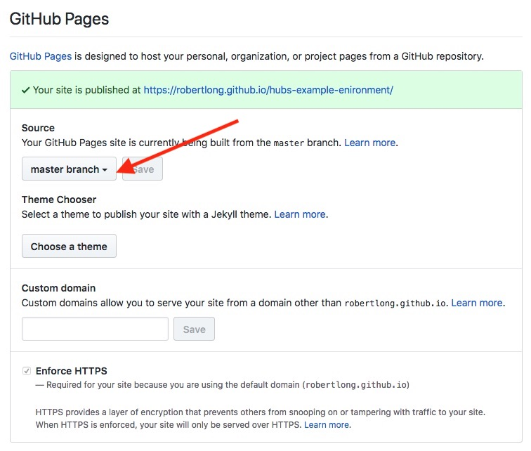

# Hubs Example Environment

This project shows you how to create a custom environment for [Mozilla Hubs](https://hubs.mozilla.com) with the [Spoke Editor](https://github.com/MozillaReality/Spoke).

## Using the example environment in Mozilla Hubs
1. Go to https://hubs.mozilla.com
2. In the room creation section click the `options` button.

    
3. Fill out your desired room name and the link to the `.gltf` scene.
    
    Example link:
    ```
    https://robertlong.github.io/hubs-example-environment/ExampleRoomExport/Scene.gltf
    ```
    
4. Hit create room and share the link with others.

## Creating your own custom environment using the example project and the Spoke Editor

If you haven't set up the Spoke Editor or completed the [Getting Started tutorial](https://github.com/MozillaReality/Spoke/wiki/Getting-Started) you should complete that first.

1. Fork the repository.

    
2. Go to the repository settings page.

    
3. In the Github Pages section. Ensure that the Source is set to the master branch. This will ensure that every push to the master branch will be reflected in your environment.

    
4. Back on your repository page, clone the repository using the command line or github desktop client.

    
5. At this point you should have a `hubs-example-environment` folder on your computer. Open the directory in your terminal and run the `spoke` command.
    ```
    cd hubs-example-environment
    spoke
    ```
6. Make any changes you want to the `ExampleRoom.scene` or create a new scene.
7. Export your desired scene in the Spoke editor.
8. Push your changes to github.
9. Your custom environment will be available on your github page.
    ```
    https://<my github username>.github.io/hubs-example-environment/<path to my scene>/Scene.gltf
    ```
10. Follow the previous guide to load your custom environment into Hubs.
